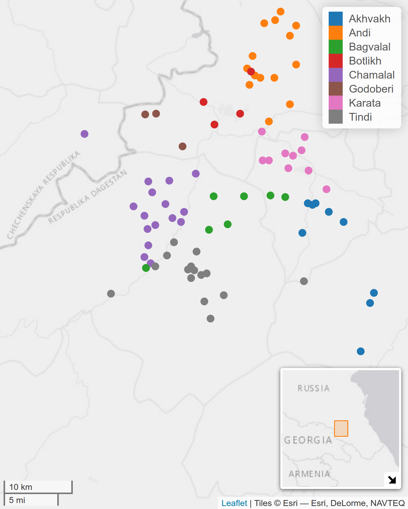

```{r, include=FALSE}
knitr::opts_chunk$set(echo = FALSE, warning = FALSE, message = FALSE, dev='cairo_pdf')
library(tidyverse)
theme_set(theme_bw())
```

# First slide

## First slide

# About me

## About me

- Field Linguistics
    - Language documentation
    - Phonetics
    - Phonology
    - East and West Caucasian languages 

```{r, fig.height=2}
df <- read_csv("data/expeditions.csv")
df %>% 
  mutate(language = factor(language, levels = c("Circassian", "Abaza", "Dargwa", "Andi", "Rutul"))) %>% 
  ggplot(aes(x = year, y = language, label = language))+
  geom_point()+
  scale_x_continuous(breaks = 2010:2022)+
  theme_minimal()+
  labs(x="",y="")
```
\pause

- Computer linguistics
    - R packages: `lingtypology`, `phonfieldwork`, `lingglosses`
    - Morphological Transducers
    - Quantitative Linguistics

# Andic languages

## Nakh-Dagestanian (East Caucasian, Northeast Caucasian)

- Nakh languages
- Khinalug language
- Lezgic languages
- Lak language
- Dargwa (Dargic) languages
- Tsezic (Didoic) languages
- Avar language
- Andic languages:

\small
```{r}
read_csv("data/andic_languages_list.csv", na = "NA") %>% 
  kableExtra::kable(align = c("l", "l", "r", "l"))
```

## Andic languages [@moroz20]

```{r, eval=FALSE}
library(tidyverse)
library(lingtypology)

read_tsv("https://raw.githubusercontent.com/sverhees/master_villages/master/data/villages.tsv") %>% 
  filter(aff == "Andic",
         lat > 42,
         lat < 43) ->
  df

map.feature(df$lang,
            features = df$lang,
            lat  = df$lat,
            long = df$lon,
            tile = "Esri.WorldGrayCanvas", 
            minimap = TRUE)
```

```{r, fig.align="center", out.height="85%"}

```

Created with `lingtypology` [@moroz17].

# References {.allowframebreaks}
