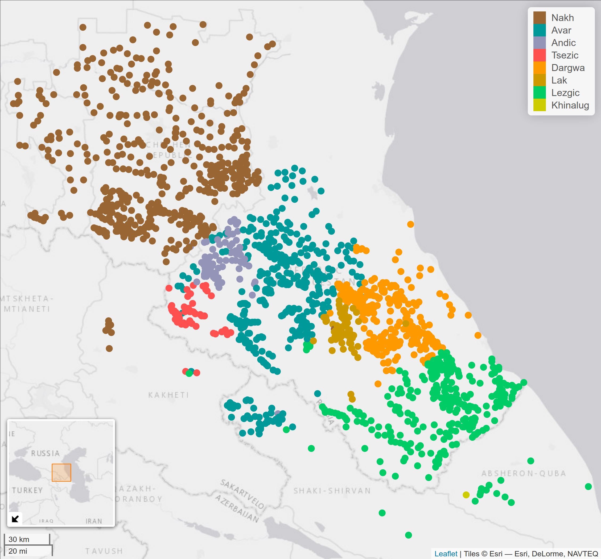
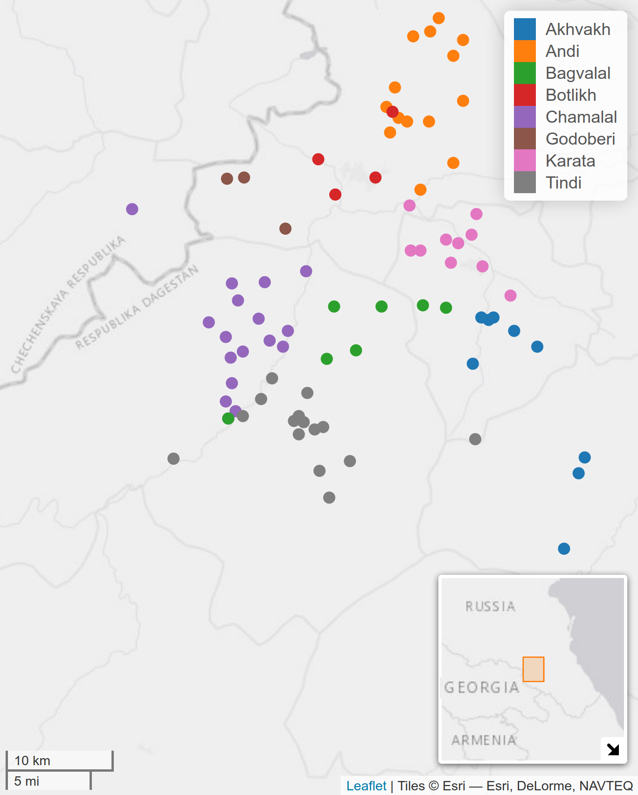
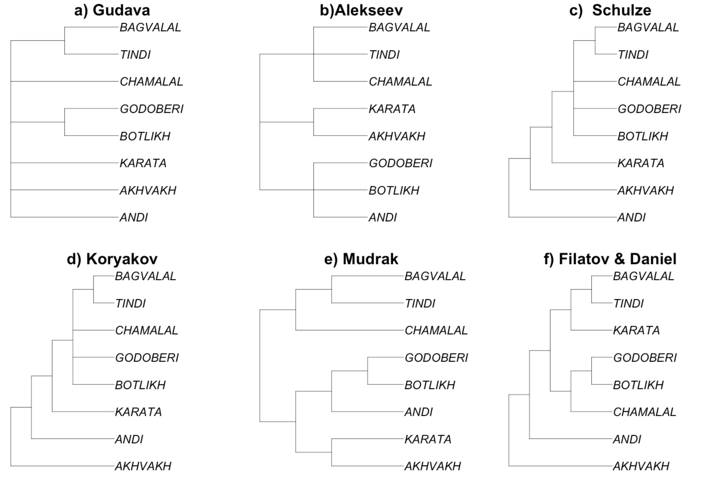

```{r, include=FALSE}
knitr::opts_chunk$set(echo = FALSE, warning = FALSE, message = FALSE, dev='cairo_pdf')
library(tidyverse)
theme_set(theme_minimal()+theme(legend.position = "bottom", text = element_text(size = 18)))
read_csv("/home/agricolamz/work/databases/andic_dicts/andic_dicts.csv") %>% 
  mutate(language = case_when(language == "Akhvakh" ~ "N. Akhvakh", 
                              language == "Karata-Tukita" ~ "Karata",
                              language == "Tokita" ~ "Tukita",
                              TRUE ~ language)) ->
  andic_dicts
```

## Preamble

# About me

## About me

- Field Linguistics
    - Language documentation
    - Phonetics
    - Phonology
    - East and West Caucasian languages 

```{r, fig.height=2}
df <- read_csv("data/expeditions.csv")
df %>% 
  mutate(language = factor(language, levels = c("Circassian", "Abaza", "Dargwa", "Andi", "Rutul"))) %>% 
  ggplot(aes(x = year, y = language, label = language))+
  geom_point()+
  scale_x_continuous(breaks = 2010:2022)+
  theme_minimal()+
  labs(x="",y="")
```
\pause

- Computer linguistics
    - R packages: `lingtypology`, `phonfieldwork`, `lingglosses`
    - Quantitative Linguistics
    - Morphological Transducers

# Andic languages

## East Caucasian (Nakh-Dagestanian)

- Nakh languages
- Khinalug language
- Lezgic languages
- Lak language
- Dargwa (Dargic) languages
- Tsezic (Didoic) languages
- Avar language
- Andic languages [@dobrushina20; @koryakov22]:

\small
```{r}
read_csv("data/andic_languages_list.csv", na = "NA") %>% 
  kableExtra::kable(align = c("l", "l", "r", "l"), vline = "", linesep = "", toprule = "", midrule = "", bottomrule = "")
```
\normalsize

## East Caucasian [@moroz20]

```{r, eval=FALSE}
library(tidyverse)
library(lingtypology)

read_tsv("https://raw.githubusercontent.com/sverhees/master_villages/master/data/villages.tsv") %>% 
  filter(!(aff %in% c("Iranian", "Kipchak", "Oghuz", "Armenic", "Georgic")),
         !is.na(lang),
         !kutans) %>% 
  mutate(lang = case_when(lang == "Dargwa" ~ "North Dargwa",
                          lang == "Khwarshi" ~ "Khwarshi-Inkhoqwari",
                          lang == "Tsova-Tush" ~ "Bats",
                          TRUE ~ lang),
         aff = factor(aff, levels = c("Nakh", "Avar", "Andic", "Tsezic", "Dargwa", "Lak", "Lezgic", "Khinalug")))->
  df

df %>% 
  count(aff, aff_col)

map.feature(df$lang,
            features = df$aff,
            color = c("#996633", "#009999", "#9494b8", "#ff5050", "#ff9900", "#cc9900", "#00cc66", "#cccc00"),
            lat  = df$lat,
            long = df$lon,
            tile = "Esri.WorldGrayCanvas", 
            minimap = TRUE,minimap.position = "bottomleft")
```

```{r, fig.align="center", out.height="86%"}

```

Created with `lingtypology` [@moroz17].

## Andic languages [@moroz20]

```{r, eval=FALSE}
library(tidyverse)
library(lingtypology)

read_tsv("https://raw.githubusercontent.com/sverhees/master_villages/master/data/villages.tsv") %>% 
  filter(aff == "Andic",
         lat > 42,
         lat < 43) ->
  df

map.feature(df$lang,
            features = df$lang,
            lat  = df$lat,
            long = df$lon,
            tile = "Esri.WorldGrayCanvas", 
            minimap = TRUE)
```

```{r, fig.align="center", out.height="86%"}

```

Created with `lingtypology` [@moroz17].

## Classification of Andic languages

- It has been suggested that Andic languages as a whole may in fact represent a language continuum [@gudava67]. 
- Some village varieties of what is traditionally considered one language may be highly divergent from its other varieties.

## Classification of Andic languages [@koile22]

```{r, fig.align="center", out.height="86%"}

```

# References for Andic languages

## References for Andic languages

| language   | grammar | dictionary | (Kibrik et al.) | (Key et al.) |
|------------|:-------:|:----------:|:---------------:|:------------:|
| Andi       |    +    |      -     |        +        |       +      |
| Lower Andi |    -    |      -     |        -        |       +      |
| Botlikh    |    +    |     ++     |        -        |       +      |
| Godoberi   |    +    |      +     |        -        |       +      |
| Karata     |    +    |      +     |        -        |       +      |
| Tukita     |    -    |    $\mp$   |        -        |       +      |
| N. Akhvakh |    +    |      +     |        +        |       +      |
| S. Akhvakh |    -    |      -     |        -        |       +      |
| Bagvalal   |    +    |      +     |        -        |       +      |
| Tindi      |    +    |      +     |        -        |       +      |
| Chamalal   |    +    |      +     |        +        |       +      |
| Gigatli    |    -    |      -     |        +        |       +      |

- all Andic dictionaries for IDS were provided by Madzhid Khalilov.

\nocite{kibrik90}
\nocite{ids21}

## Pros and cons of Andic part of [IDS](https://ids.clld.org/contributors/madzhidkhalilov) [@ids21]

- the best language and lexicon coverage (more than 1300 meanings) \pause
- unified transcription \pause
- absence of anything but translation \pause
- a lot of typos (p. c. by several East Caucasian researchers)
    - Andi: ɢannni 'crow' vs. ɢʷaɢʷal 'nut' [@ids21]
    - Andi: ʁannni 'crow' vs. ɢʷaɢʷal 'nut' [@kibrik90] and my personal fieldwork data 
    - Botlikh: ts'ik'ːu 'sour' [@ids21] vs ts'ːik'ːu 'sour' [@saidova12; @alekseev19] \pause
- contradictions with conventional dictionaries  
    - Botlikh: beχiq'al 'hip' [@ids21] vs aqχu 'hip' [@saidova12] \pause
- one word per meaning (in most cases)
    - Godoberi: χʷaji 'dog' [@ids21] vs. χʷaji 'dog' and baħri 'dog' [@saidova06]

# Comparative Andic dictionary database

## Comparative Andic dictionary database v. 0.6

--- collection of digitized dictionaries of Andic languages.

<https://github.com/phon-dicts-project/comparative_andic_dictionary_database>

A lot of people contributed and continue contributing to the database: A. Averin, D. Chistyakova, K. Chuprinko, A. Davidenko, M. Dolgodvorova, N. Fedorenko, T. Gnedina, G. Kuznetsov, C. Naccarato, G. Moroz, I. Sadakov, Z. Shkutko, A. Tsyzova, S. Verhees.

There are `r nrow(andic_dicts)` rows in the database.

## Comparative Andic dictionary database v. 0.6

* `id_word`: 9
* `id_meaning`: 1
* `id`: 11
* `lemma`: а'ва
* `ipa`: 'a-w-a
* `morphology`: (-лъ̄илIи / -лIи, /ди)
* `bor`: _
* `borrowing_source_language`: _
* `pos`: noun
* `meaning_ru`: дом [house]
* `definition`: 1) дом, здание; *ава гурулъIа* строить дом 2) этаж; *кьIас̄е ава* верхний этаж; *гекьис̄е ава* нижний этаж; _цег._, _тлян._ *авал*, _ратл._ *авали*
* `glottocode`: akhv1239
* `language`: N. Akhvakh
* `reference`: Magomedova, Abdulayeva 2007

## Comparative Andic dictionary database v. 0.6

* `id_word`: 9
* `id_meaning`: 2
* `id`: 12
* `lemma`: а'ва
* `ipa`: 'a-w-a
* `morphology`: (-лъ̄илIи / -лIи, /ди)
* `bor`: _
* `borrowing_source_language`: _
* `pos`: noun
* `meaning_ru`: этаж [floor]
* `definition`: 1) дом, здание; *ава гурулъIа* строить дом 2) этаж; *кьIас̄е ава* верхний этаж; *гекьис̄е ава* нижний этаж; _цег._, _тлян._ *авал*, _ратл._ *авали*
* `glottocode`: akhv1239
* `language`: N. Akhvakh
* `reference`: Magomedova, Abdulayeva 2007

## Comparative Andic dictionary database v. 0.6

* `id_word`: 17
* `id_meaning`: 1
* `id`: 21
* `lemma`: ава'рийа
* `ipa`: a-w-'a-r-i-j-a
* `morphology`: (-лIи, -ди)
* `bor`: 1
* `borrowing_source_language`: rus
* `pos`: noun
* `meaning_ru`: авария [accident]
* `definition`: авария (_дорожное происшествие_); *аварийа-лъ̄ига бухьурулъIа* попасть в аварию
* `glottocode`: akhv1239
* `language`: N. Akhvakh
* `reference`: Magomedova, Abdulayeva 2007

## Comparative Andic dictionary database v. 0.6

Number of lemmata per dictionary:

```{r}
andic_dicts %>% 
  distinct(language, reference, lemma) %>% 
  count(language, reference)  %>% 
  rename(lemmata = n) 
```

## Comparative Andic dictionary database v. 0.6

Number of meanings per dictionary:

```{r}
andic_dicts %>% 
  count(language, reference)  %>% 
  rename(meanings = n) 
```

## Comparative Andic dictionary database v. 0.6

Number of borrowings per dictionary:

```{r}
andic_dicts %>% 
  mutate(borrowing_source_language =
           case_when(str_detect(borrowing_source_language, "^arab") ~ "Arabic",
                     str_detect(borrowing_source_language, "^pers") ~ "Persian",
                     borrowing_source_language == "mid-pers" ~ "Persian",
                     str_detect(borrowing_source_language, "^rus") ~ "Russian",
                     str_detect(borrowing_source_language, "^turk") ~ "Turkic",
                     is.na(borrowing_source_language) ~ "native",
                     borrowing_source_language == "\\?" ~ "unknown")) %>% 
  filter(borrowing_source_language != "unknown") %>% 
  mutate(borrowing_source_language = fct_infreq(borrowing_source_language)) %>%
  count(language, reference, borrowing_source_language) %>%
  group_by(language, reference) %>% 
  mutate(total = sum(n),
         ratio = n/total) %>%
  ungroup() %>% 
  mutate(language = str_c(language, "\n", reference),
         language = fct_reorder(language, total)) %>% 
  ggplot(aes(ratio, language))+
  geom_col(aes(fill = borrowing_source_language))+
  geom_label(x = 1.09, aes(label = total))+
  labs(y = "", x = "", fill = "")+
  scale_x_continuous(labels = scales::percent, limits = c(0, 1.14))
```

## Comparative Andic dictionary database v. 0.6

Number of borrowings per dictionary: (Avar annotation needed)

```{r}
andic_dicts %>% 
  mutate(borrowing_source_language =
           case_when(str_detect(borrowing_source_language, "^arab") ~ "Arabic",
                     str_detect(borrowing_source_language, "^pers") ~ "Persian",
                     borrowing_source_language == "mid-pers" ~ "Persian",
                     str_detect(borrowing_source_language, "^rus") ~ "Russian",
                     str_detect(borrowing_source_language, "^turk") ~ "Turkic",
                     is.na(borrowing_source_language) ~ "native",
                     borrowing_source_language == "\\?" ~ "unknown")) %>% 
  filter(borrowing_source_language != "unknown") %>% 
  mutate(borrowing_source_language = fct_infreq(borrowing_source_language)) %>%
  count(language, reference, borrowing_source_language) %>%
  group_by(language, reference) %>% 
  mutate(total = sum(n),
         ratio = n/total) %>%
  ungroup() %>% 
  mutate(language = str_c(language, "\n", reference),
         language = fct_reorder(language, total)) %>% 
  ggplot(aes(ratio, language))+
  geom_col(aes(fill = borrowing_source_language))+
  geom_label(x = 1.09, aes(label = total))+
  labs(y = "", x = "", fill = "")+
  scale_x_continuous(labels = scales::percent, limits = c(0, 1.14))
```

# Preliminary results

## Preliminary results: phonological distance

- remove Tukita
- remove borrowings
- remove the stress sign
- select meanings shared across all dictionaries
- calculate frequencies of each segment
- use the obtained frequencies for distance calculation
- apply hierarchical clustering to the gathered distances

## Preliminary results: phonological distance

```{r}
library(tidytext)

andic_dicts %>% 
  mutate(languages_source = str_c(language, " (", reference, ")")) %>% 
  filter(!is.na(meaning_ru),
         glottocode != "toki1238",
         is.na(bor)) %>% 
  select(languages_source, ipa, meaning_ru) %>% 
  group_by(meaning_ru, languages_source) %>%
  mutate(id = 1:n()) %>% 
  sample_n(1) %>% 
  select(-id) %>% 
  pivot_longer(names_to = "names", values_to = "value",  ipa) %>% 
  select(-names) %>% 
  pivot_wider(names_from = languages_source, values_from = value) %>% 
  ungroup() %>% 
  mutate(n_languages = select(., -meaning_ru) %>% is.na() %>% rowSums(),
         n_languages = 9 - n_languages) %>% 
  filter(n_languages == 9) %>% 
  select(-n_languages) %>% 
  pivot_longer(names_to = "language", values_to = "ipa", -meaning_ru) %>% 
  mutate(ipa = str_remove(ipa, "(?<=(-)|(^))'"),
         language = str_replace(language, " \\(", "\n(")) %>% 
  unnest_tokens(input = ipa, output = "segment",  token = str_split, pattern = "-") %>% 
  count(language, segment) %>% 
  mutate(ratio = n/sum(n)) %>% 
  select(language, segment, ratio) %>% 
  mutate(segment = as.integer(as.factor(segment))) %>% 
  pivot_wider(names_from = segment, values_from = ratio, values_fill = 0) %>% 
  as.data.frame() ->
  for_clust

rownames(for_clust) <- for_clust$language

library(ggdendro)
for_clust %>%
  select(-language) %>% 
  dist(method = "manhattan") %>% 
  hclust() %>% 
  as.dendrogram() %>% 
  dendro_data(type = "rectangle") ->
  dd

ggplot(segment(dd)) + 
  geom_segment(aes(x = x, y = y, xend = xend, yend = yend)) + 
  coord_flip() + 
  scale_y_reverse(expand = c(0.2, 0))+
  geom_text(data = label(dd), 
              aes(x = x, y = y, label = label), size = 4)+
  theme_void()+
  labs(caption = "Based on 453 shared meanings\nfrom Comparative Andic dictionary database v. 0.6") ->
  phonological_distance
phonological_distance
```

## Classification of Andic languages [@koile22]

```{r, fig.align="center", out.height="86%"}

```

## Preliminary results: phonological distance

```{r}
phonological_distance
```

## Andic languages [@moroz20]

```{r, fig.align="center", out.height="86%"}

```

Created with `lingtypology` [@moroz17].

## Can dictionary data be trusted?

- There are some morphemes that could increase frequency of certain segments (inf, adjectivizer).
- There are a lot of Avar borrowings that are not annotated.
- However, in [@davidenko21] we compared dictionary and corpora segment frequencies of Andi, Botlikh and Bagvalal phonological segments and found a linear relation between them:

$$\text{corpora frequency} = 0.002 + 0.906 \times \text{dictionary frequency}$$

## Preliminary results: colexification (see the CLICS project [@rzymski20])

```{r, eval = FALSE}
andic_dicts %>% 
  add_count(language, reference, lemma) %>% 
  filter(n > 1,
         !is.na(meaning_ru)) %>% 
  distinct(language, reference, id_word, meaning_ru) %>% 
  add_count(meaning_ru) %>% 
  arrange(-n) ->
  result

library(progress)
pb <- progress_bar$new(format = ":percent", total = length(result$meaning_ru))

res <- map(result$meaning_ru, function(i){
  pb$tick()
  result %>% 
    filter(meaning_ru == i) %>% 
    rename(first_word = meaning_ru) %>% 
    left_join(result, by = c("language", "reference", "id_word")) %>% 
    filter(meaning_ru != i) %>% 
    select(-id_word) %>% 
    rename(second_word = meaning_ru) %>% 
    distinct(language, reference, first_word, second_word) %>% 
    add_count(first_word, second_word) %>% 
    filter(n > 1) %>% 
    write_csv("data/colexifications.csv", append = TRUE, col_names = FALSE, progress = FALSE)
})

df <- read_csv("data/colexifications.csv")

colnames(df) <- c("first_word", "reference", "language", "second_word", "n_languages")
df %>% 
  select(language, reference, first_word, second_word) %>% 
  distinct(language, reference, first_word, second_word) %>% 
  add_count(first_word, second_word) %>% 
  arrange(-n) %>% 
  View()
```


- 'COTTON' and 'COTTON WOOL' (9 languages)
- 'WRITE' and 'PLAY (musical instruments)' (8 languages)
- 'NATURE' and 'CHARACTER, TEMPER' (8 languages)
- 'HOLD' and 'TRAP (CATCH)' (8 languages), see [\alert {CLICS}](https://clics.clld.org/edges/1170-1448)
- 'REFUSE' and 'DENY' (8 languages), see [\alert {CLICS}](https://clics.clld.org/edges/49-755)
- 'PAPER' and 'LETTER' (8 languages), see [\alert {CLICS}](https://clics.clld.org/edges/648-1612)
- '(STRING) THREAD' and 'WHETSTONE' (8 languages)
- 'DRESS' and 'SHIRT' (8 languages), see [\alert {CLICS}](https://clics.clld.org/edges/474-1622)
- and about 4500 other cases.

## Preliminary results: colexification

```{r}
colexification <- read_csv("data/colexifications.csv", col_names = FALSE)

colnames(colexification) <- c("first_word", "reference", "language", "second_word", "n_languages")

colexification %>% 
  select(language, reference, first_word, second_word) %>% 
  distinct(language, reference, first_word, second_word) %>% 
  add_count(first_word, second_word) %>% 
  arrange(-n) %>% 
  distinct(first_word, second_word, n) %>%
  rename(n_languages = n) %>% 
  count(n_languages) %>% 
  mutate(n = n/2) %>% 
  ggplot(aes(n_languages, n))+
  geom_col()+
  geom_text(aes(label = n), nudge_y = 100)+
  scale_x_continuous(breaks = 1:9)+
  labs(x = "number of languages with shared colexification",
       y = "",
       caption = "Based on Comparative Andic dictionary database v. 0.6")
```

## What can be done with this database?

- calculate frequency of phonological units and compare them across Andic languages
- use some modern tools like Edictor [@list2017d] for automatic analysis of sound correspondences
- annotate meanings using concepts from Concepticon [@concepticon21] with `pyconcepticon` and use some tools for investigation of the colexification (see the CLICS project [@rzymski20])
- the database also could be a good ground for selecting words for a phonetic or any other research
- compare morphological patterns across languages 
- extract language examples and use them as a corpus

# Conclusions

## Conclusions

- Digitalization provides a lot of new data for possible research
    - However it take a lot of effort to create and curate such a database
- Phonological distance can reveal new information and pose new questions
    - See [@cysouw09] for the similar approach to spatial case marking in Tsezic
- There is a lot that we do not know about colexification in East Caucasian languages

# References {.allowframebreaks}
